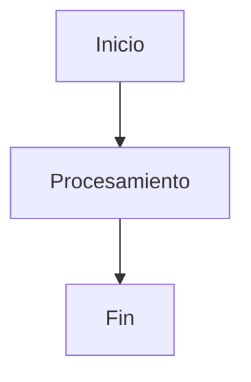

# {{title}}

## 1. RESUMEN EJECUTIVO
*Breve resumen de los hallazgos, decisiones clave y el impacto principal de este reporte.*

---

## 2. CONTEXTO Y ANÁLISIS
*Descripción del estado actual, el problema que se aborda o la investigación realizada.*

### Métricas / Comparativas
*(Usa tablas o gráficos de Mermaid si es necesario)*

---

## 3. PROPUESTA / ACCIONES TOMADAS
*Detalle de la propuesta técnica, soluciones implementadas o decisiones tomadas.*

---

## 4. PRÓXIMOS PASOS (PLAN DE ACCIÓN)
- [ ] **Acción 1:** Detalle de la tarea.
- [ ] **Acción 2:** Detalle de la tarea.
