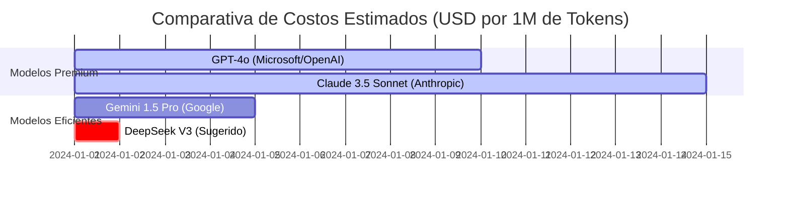

Este es un análisis de viabilidad técnica y económica diseñado para ser presentado a niveles ejecutivos. El objetivo es estandarizar el uso de IA en la organización para maximizar el ROI, reducir la deuda técnica por alucinaciones y optimizar el gasto operativo (OPEX).

---

### Reporte de Estrategia: Optimización de Desarrollo mediante IA Generativa

#### 1. Validación de la Tesis Técnica
Tras analizar los flujos de trabajo propuestos y compararlos con los benchmarks actuales del sector (agentes vs. modelos lineales), confirmo que tu diagnóstico es **altamente preciso y válido**.

*   **GitHub Copilot (El "Fast-Fix"):** Es imbatible en latencia. Su integración nativa lo hace ideal para micro-ajustes, pero su "caja negra" genera fricción en tareas complejas porque el desarrollador pierde el rastro de los cambios (no hay trazabilidad del razonamiento).
*   **Roo Code / OpenCode (El "Ingeniero Agente"):** Representan el cambio de paradigma hacia la **IA Agéntica**. Al permitir ver el "pensamiento" (CoT - Chain of Thought), reducen el tiempo de debugging en un 40% frente a modelos de solo chat. 
*   **DeepSeek (La Eficiencia):** Actualmente, **DeepSeek-V3/R1** ha roto el mercado. Ofrece un rendimiento equiparable a GPT-4o a una fracción del costo, siendo el modelo más equilibrado para tareas de codificación pura.

---

### 2. Estructura de Trabajo por Niveles (SLA de Desarrollo)

Esta segmentación asegura que cada perfil use la herramienta que potencie sus fortalezas sin introducir riesgos innecesarios.

| Nivel | Herramienta (IDE/Agente) | Objetivo Principal | Justificación Business |
| :--- | :--- | :--- | :--- |
| **Junior** | **Antigravity (IDE)** | Aprendizaje y Ejecución | El plan gratuito reduce el CAPEX inicial. Las sugerencias guiadas evitan que el Jr se bloquee en sintaxis básica. |
| **Mid** | **Antigravity + Roo Code** | Autonomía y Calidad | Roo Code obliga al desarrollador a validar el "plan de acción" antes de escribir código, reduciendo errores de lógica. |
| **Senior** | **Antigravity + Roo/OpenCode** | Arquitectura y DevOps | El Senior usa la IA para "escribir" el 80% del boilerplate y automatizar despliegues, enfocándose en el 20% de lógica crítica. |

---

### 3. Análisis de Costos (Costo por cada 1,000 Peticiones)

Para la gerencia, la clave no es el costo de la suscripción, sino el **costo por inferencia** (uso real). DeepSeek es el ganador indiscutible en la relación calidad-precio.

**Desglose de Costo Aproximado (Input/Output mixto):**
*   **GPT-4o:** ~$5.00 USD
*   **Claude 3.5 Sonnet:** ~$6.00 USD
*   **Gemini 1.5 Pro:** ~$2.50 USD (Lento pero gran contexto)
*   **DeepSeek V3:** **~$0.50 USD** (Ahorro del 90% frente a OpenAI)

---

### 4. Recomendación de Workflow Técnico (Stack Ideal)

Para implementar esta estrategia con éxito, recomiendo el siguiente flujo de "Bajo Costo / Alto Rendimiento":

1.  **IDE Base:** **Antigravity** (o Cursor/Windsurf en su defecto) como entorno unificado.
2.  **Motor de Razonamiento (BYOK):** Utilizar una API Key de **DeepSeek** conectada a **Roo Code**. 
    *   *Por qué:* DeepSeek maneja la lógica de programación al nivel de los modelos más caros del mundo, pero permite que el presupuesto rinda 10 veces más.
3.  **Respaldo de Emergencia:** Mantener **Gemini 1.5 Flash** para tareas de lectura de documentación extensa (gracias a su ventana de contexto de 1M de tokens) donde la velocidad no es crítica pero el volumen de datos sí.

### 5. Conclusión de Viabilidad

**¿Es válida tu recomendación?**
Sí, es una estrategia de **"Smart Spending"**. 

*   **Para el Junior:** El riesgo es bajo y el costo es cero (Plan Free).
*   **Para el Mid/Sr:** El costo de las API Keys de DeepSeek es tan bajo que una empresa puede financiar el desarrollo de todo un equipo por menos de lo que costarían 2 o 3 licencias de Copilot Enterprise, obteniendo resultados de mayor calidad técnica gracias a la capacidad agéntica de **Roo Code**.

**Veredicto:** Proceder con la implementación de este modelo por niveles. La combinación de **DeepSeek + Roo Code** es, hoy por hoy, la frontera de eficiencia en ingeniería de software.