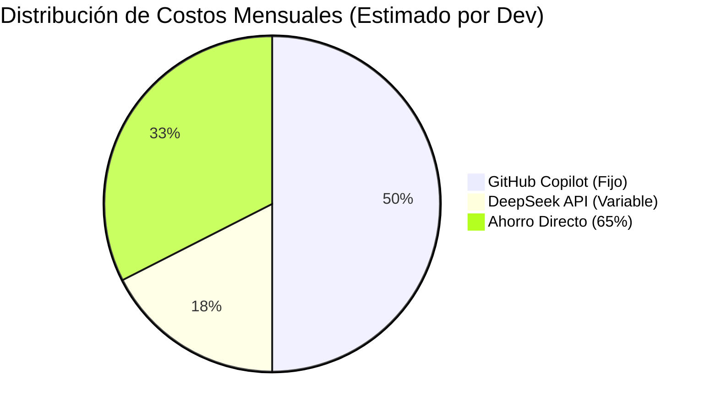
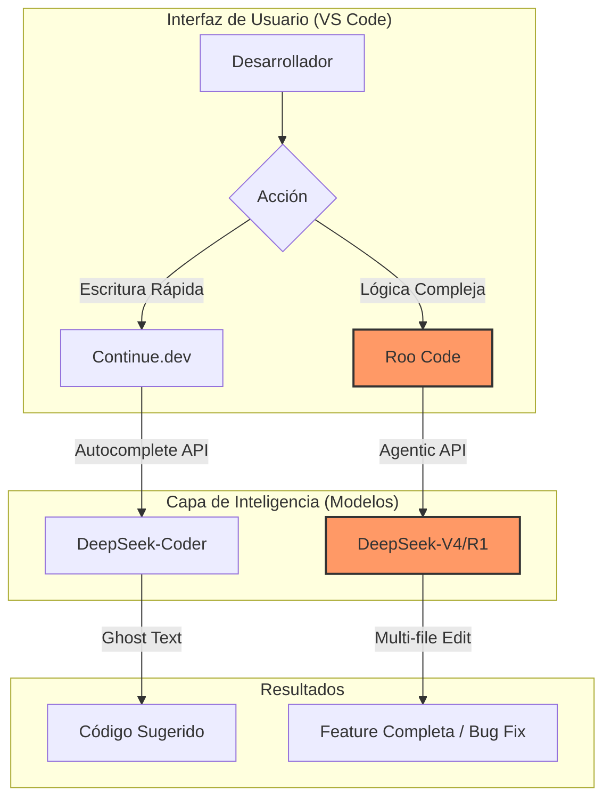

Este reporte está diseñado para ser presentado ante una gerencia técnica o financiera (CTO/CFO). El enfoque es **pragmático**: demuestra cómo estamos migrando de un modelo de "Suscripción Fija" a uno de "Valor por Desempeño", incrementando la capacidad de razonamiento de los desarrolladores mientras reducimos costos.

---

# Reporte de Estrategia: Optimización del Stack de IA (2025)
**De:** Arquitectura de Software
**Para:** Gerencia / Dirección de Tecnología
**Asunto:** Justificación Técnica y Financiera: Transición de GitHub Copilot a Lean AI Stack (DeepSeek + Continue + Roo Code)

## 1. Resumen Ejecutivo
El presente documento propone la sustitución de las licencias fijas de GitHub Copilot por un ecosistema de herramientas de código abierto (Continue y Roo Code) potenciadas por la API de **DeepSeek**. 

**Objetivos principales:**
1.  **Reducción de costos:** Pasar de un costo fijo de $10-$19 USD/mes por usuario a un costo variable estimado de **$2.50 - $4.00 USD/mes**.
2.  **Aumento de la capacidad agéntica:** Implementar capacidades de resolución de problemas complejos que Copilot no ofrece actualmente.
3.  **Soberanía Tecnológica:** Eliminar el *vendor lock-in* de Microsoft/OpenAI.

## 2. Comparativa Técnica: Copilot vs. Lean Stack

| Característica | GitHub Copilot | Lean Stack (DeepSeek + Continue + Roo) | Ventaja Lean Stack |
| :--- | :--- | :--- | :--- |
| **Modelo Base** | GPT-4o / Codex | **DeepSeek V3/R1/V4** | **Razonamiento Lógico:** DeepSeek supera a GPT-4o en benchmarks de código. |
| **Autocompletado** | Integrado (Baja latencia) | Continue.dev (Baja latencia) | **Personalización:** Podemos ajustar el modelo según el rol. |
| **Capacidad Agéntica** | Limitada (Chat básico) | **Roo Code (Agente Autónomo)** | **Productividad:** Roo Code puede editar múltiples archivos y ejecutar tests solo. |
| **Costo** | $10 - $19 USD (Fijo) | Pago por uso (Créditos API) | **ROI:** Solo se paga por lo que se consume realmente. |
| **Privacidad** | Estándar Enterprise | API Enterprise (Zero Data Retention) | **Seguridad:** Los datos no se usan para re-entrenar modelos. |

---

## 3. Análisis de Costos Estimados (Por Desarrollador)

Basado en un consumo promedio de un desarrollador "heavy user" (aprox. 3-5 millones de tokens mensuales entre autocompletado y chat):

*   **GitHub Copilot:** $10.00 USD (Precio base individual).
*   **Lean Stack (DeepSeek):** ~$3.50 USD (Basado en el precio de $0.27 por 1M de tokens de salida de DeepSeek).
*   **Ahorro Proyectado:** **65% de reducción** en gasto directo de IA.

---

## 4. Arquitectura del Flujo de Trabajo (SDLC)

El siguiente diagrama visualiza cómo las herramientas propuestas cubren todo el ciclo de vida del desarrollo de forma más eficiente que una herramienta única.

---

## 5. Justificación del Uso de Modelos por Rol

Para maximizar la eficiencia, el Arquitecto propone la siguiente distribución de recursos:

1.  **Junior/Mid (Foco en Ejecución):**
    *   **Roo Code + DeepSeek:** Actúa como un "Senior Virtual". DeepSeek tiene un razonamiento superior para explicar por qué se implementa un patrón, reduciendo la carga de revisión de los Seniors.
2.  **Senior/Arquitecto (Foco en Contexto):**
    *   Se mantiene el acceso a **Gemini 1.5/2 Pro** (vía API en OpenCode/Continue) para tareas de planeación que requieran leer el repositorio completo (Ventana de contexto de 1M+ tokens), algo que Copilot no puede procesar.

---

## 6. Viabilidad y Riesgos

### Viabilidad Técnica
*   **Latencia:** El uso de la API de DeepSeek para autocompletado es comparable a Copilot si se usa un proveedor de baja latencia o su API directa.
*   **Curva de Aprendizaje:** Continue.dev es casi idéntico a Copilot en UX. Roo Code requiere una inducción de 30 minutos.

### Riesgos y Mitigación
*   **Riesgo:** Caída de la API de DeepSeek.
*   **Mitigación:** Al usar herramientas Open Source (Continue/Roo), podemos cambiar instantáneamente el modelo a Claude 3.5 o GPT-4o en segundos sin cambiar de software. **Esto nos da resiliencia total.**

## 7. Conclusión del Arquitecto
La transición a un modelo de **IA Agéntica (Roo Code) + Autocompletado Abierto (Continue)** es el paso lógico para un equipo de alto rendimiento. No solo estamos ahorrando un 65% en costos operativos, sino que estamos equipando a los desarrolladores con un agente capaz de resolver tareas complejas de forma autónoma, superando la limitación de "simple chat" de GitHub Copilot.
