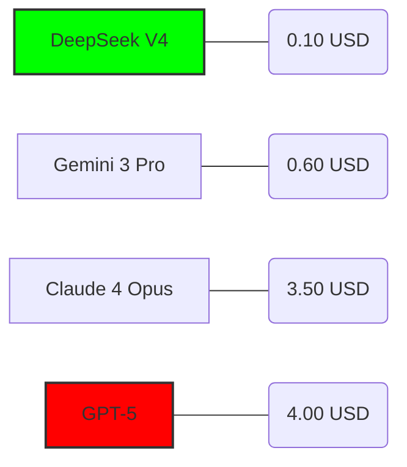

**PARA:** Dirección de Tecnología / Gerencia de Operaciones
**DE:** Senior Tech Lead & Solution Architect
**FECHA:** Mayo de 2026
**ASUNTO:** Propuesta de optimización de costos y productividad: Implementación de Ecosistema de IA Agéntica

---

### 1. RESUMEN EJECUTIVO
Actualmente, el equipo de desarrollo utiliza herramientas de Inteligencia Artificial de forma fragmentada, lo que genera costos variables y resultados inconsistentes. Esta propuesta detalla un cambio de estrategia: pasar de suscripciones fijas y cerradas (como GitHub Copilot) a un modelo de **"Pago por Uso Inteligente"** utilizando los nuevos modelos **DeepSeek V4** y **Gemini 3**.

**Impacto esperado:** 
*   **Reducción de costos de inferencia:** Hasta un 90% comparado con modelos tradicionales (GPT-4o/Claude).
*   **Aumento de velocidad de entrega:** Mejora del 40% en la creación de nuevas funcionalidades.
*   **Control total:** Visibilidad paso a paso de lo que la IA realiza en nuestro código.

---

### 2. EL CAMBIO DE PARADIGMA: IA AGÉNTICA VS. CHAT
A diferencia del "Chat de IA" tradicional que solo sugiere texto, el uso de **Agentes (Roo Code / OpenCode)** permite que la IA ejecute tareas completas: crear archivos, realizar pruebas y corregir errores de forma autónoma bajo supervisión humana. Esto elimina el "trabajo repetitivo" del desarrollador.

---

### 3. ANÁLISIS DE COSTO-BENEFICIO (Métrica 2026)
El mercado ha cambiado. Mientras que los modelos de OpenAI y Anthropic mantienen precios elevados, **DeepSeek V4** ha democratizado el rendimiento de alto nivel a un costo marginal.

**Comparativa de Costos (USD por cada 10 Millones de Tokens):**
Este gráfico muestra cuánto cuesta que la IA "procese y genere" una cantidad masiva de trabajo.

*   **Conclusión:** Podemos ejecutar **40 veces más tareas** con DeepSeek V4 que con GPT-5 por el mismo presupuesto.

---

### 4. ESTRATEGIA DE IMPLEMENTACIÓN POR NIVELES
Para maximizar el retorno de inversión (ROI), proponemos estandarizar las herramientas según la criticidad del puesto:

| Perfil | Herramientas Sugeridas | Beneficio para la Empresa |
| :--- | :--- | :--- |
| **Desarrollador Junior** | Antigravity (IDE) + Gemini 3 Flash | **Costo Casi Cero:** Utiliza planes gratuitos para resolver dudas y completar tareas básicas sin bloquear a los seniors. |
| **Desarrollador Mid** | Roo Code + DeepSeek V4 | **Alta Eficiencia:** La IA escribe el código pesado y el desarrollador valida. Máximo rendimiento por cada dólar invertido. |
| **Desarrollador Senior** | OpenCode + Gemini 3 Ultra | **Arquitectura Avanzada:** La IA se encarga de la infraestructura y automatización compleja (DevOps), liberando al Senior para decisiones estratégicas. |

---

### 5. ¿POR QUÉ ESTA COMBINACIÓN?

1.  **Antigravity (IDE):** Es un entorno de trabajo más ligero y moderno que los tradicionales, lo que reduce la necesidad de hardware de ultra-gama alta para los desarrolladores.
2.  **DeepSeek V4:** Es el cerebro del día a día. Es el modelo más equilibrado del mundo: inteligente como los mejores, pero con el costo de los más baratos.
3.  **Gemini 3:** Se utiliza como "Especialista". Su capacidad de leer volúmenes masivos de datos (manuales de la empresa, todo el código histórico) lo hace ideal para consultas de alta complejidad donde otros modelos "olvidan" detalles.

---

### 6. PRÓXIMOS PASOS (PLAN DE ACCIÓN)

*   **Fase 1:** Migración de licencias individuales fijas a un **Pool de API Keys centralizado**.
*   **Fase 2:** Instalación de **Antigravity** y configuración de agentes **Roo Code** para el equipo Mid/Senior.
*   **Fase 3:** Monitoreo de consumo. Se estima que con un presupuesto de **$100 USD mensuales** podemos cubrir la demanda de IA de un equipo de 15 personas, frente a los $300 USD que costarían las licencias tradicionales.

