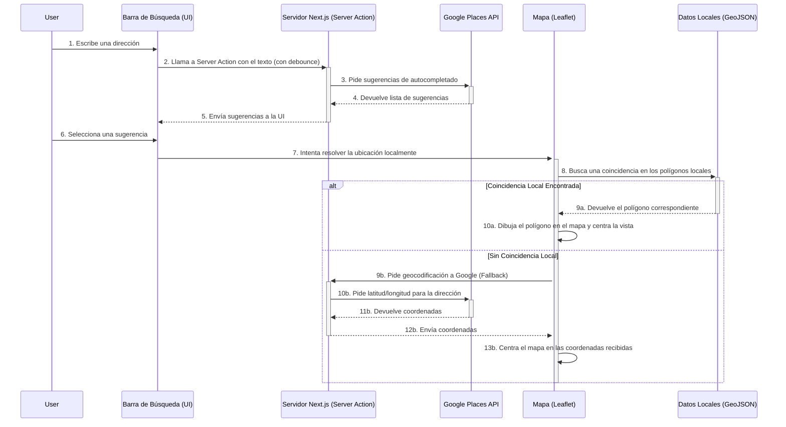

# MapUI Frontend

Esta es la interfaz de usuario principal de Patioz para la navegación y búsqueda de propiedades en un mapa interactivo. Es una aplicación construida con **Next.js (App Router)**.

## Stack Tecnológico

- **Framework:** Next.js 16 (App Router)
- **Lenguaje:** TypeScript
- **Estilos:** Tailwind CSS
- **Mapa:** Leaflet con React Leaflet
- **Tooling:** Biome (linting) y Prettier (formateo)

## Arquitectura de Búsqueda Híbrida

La funcionalidad más importante de esta aplicación es su sistema de búsqueda, que utiliza una estrategia híbrida para combinar la experiencia de usuario de Google con la precisión de los datos locales (GeoJSON).

El objetivo es doble:
1.  Ofrecer sugerencias de autocompletado rápidas y precisas a través de la API de Google Places.
2.  Priorizar la visualización de geometrías (polígonos) locales siempre que sea posible para mantener la coherencia de los datos del sistema.

### Diagrama de Flujo de Búsqueda

Este diagrama ilustra el proceso desde que el usuario interactúa con la barra de búsqueda.

## Modos de Operación: Broker vs. Directo

El cliente de búsqueda (`brokerClient.ts`) puede operar de dos maneras:

- **Modo Broker:** Si la variable de entorno `NEXT_PUBLIC_BROKER_API_URL` está definida, las peticiones se dirigen a un servicio intermediario (posiblemente el BFF) que gestiona la lógica de búsqueda.
- **Modo Directo a Google:** Si la URL del broker no está configurada, la aplicación se comunica directamente con las APIs de Google para la geocodificación de respaldo.

## Variables de Entorno Clave

Para que la aplicación funcione correctamente, es necesario configurar las siguientes variables en un archivo `.env.local`:

- `NEXT_PUBLIC_OPENSTREETMAP_URL`: URL del proveedor de teselas para el mapa base de Leaflet.
- `NEXT_PUBLIC_GEOJSON_*`: URLs de las fuentes de datos GeoJSON para las distintas divisiones administrativas (departamentos, municipios, etc.).
- `NEXT_PUBLIC_BROKER_API_URL` (Opcional): Activa el "Modo Broker".
- `GOOGLE_MAPS_API_KEY`: Clave de API para los servicios de Google (Places Autocomplete y Geocoding). Debe tener las APIs correspondientes habilitadas en Google Cloud.
