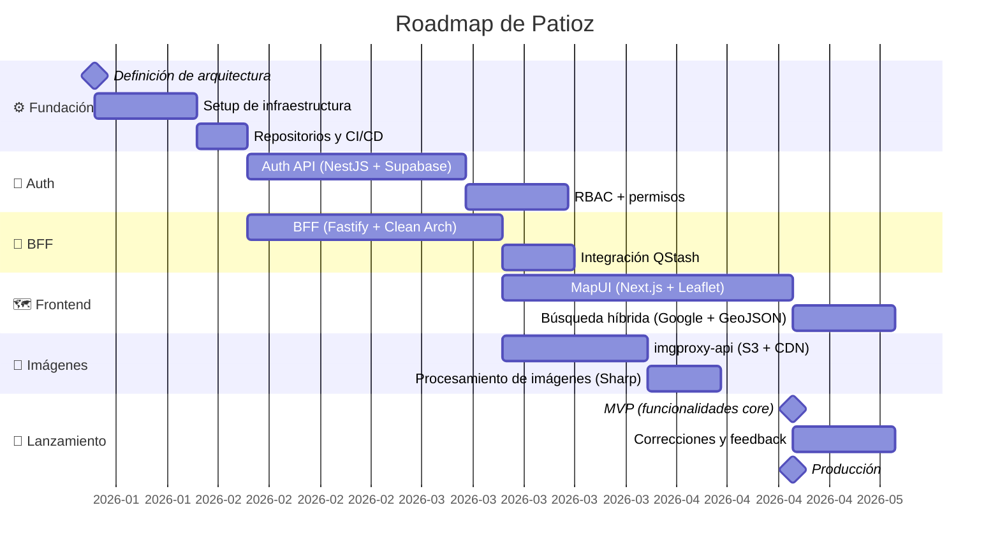

---
tags:
  - patioz/timeline
---
# 🗓 Timeline de Patioz

## Milestones Clave

| Hito | Fecha | Descripción |
|---|---|---|
| 🏗 Fundación | — | Definición de arquitectura, infraestructura, CI/CD |
| ✅ MVP | — | Funcionalidades core operativas |
| 🚀 Producción | — | Release a producción |

> *Las fechas son estimadas. Actualizar este archivo a medida que el proyecto avanza.*
