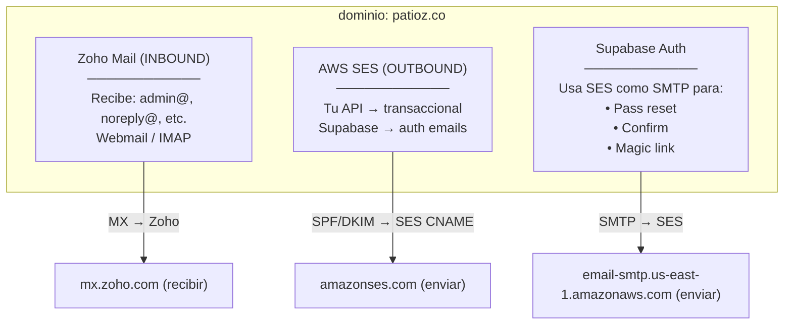

# ADR-008: Envío de Emails con AWS SES + Zoho Mail

## Contexto
El sistema necesita enviar emails transaccionales (restablecimiento de contraseña, confirmación de registro, magic links) y recibir correos entrantes en cuentas como `admin@patioz.co`, `noreply@patioz.co`, etc.

Inicialmente se plantearon servicios como SendGrid y Resend, pero sus costos a escala resultan elevados. Se evaluó auto-hospedar poste.io en un VPS de Lightsail (AWS), pero AWS bloquea el puerto 25 en Lightsail como medida anti-spam, imposibilitando el envío directo SMTP.

## Decisión

Se divide la responsabilidad de correo en dos proveedores según el flujo:

| Flujo | Proveedor | Responsabilidad |
|---|---|---|
| **Inbound (recibir)** | Zoho Mail | MX, webmail, IMAP para cuentas admin, etc. |
| **Outbound (enviar)** | AWS SES | Emails transaccionales vía API/SMTP |

**Clave:** MX apunta a Zoho (recibir), SPF autoriza a ambos (`amazonses.com` + `zohomail.com`), y Supabase simplemente usa SES como relay SMTP.

En el código del monolito modular, la integración con SES se implementa como un servicio de infraestructura tras una interfaz `IEmailSender` (Clean Architecture), permitiendo cambiar de proveedor sin afectar la lógica de negocio.

## Alternativas Consideradas

| Alternativa | Pros | Contras |
|---|---|---|
| **AWS SES (elegido)** | Costo muy bajo ($0.10/1000 emails), integración directa con AWS, sin VPS extra | Requiere salir del sandbox, configurar DKIM/SPF |
| **SendGrid** | API madura, buena entrega | Costos elevados a escala, límites restrictivos en plan free |
| **Resend** | API moderna, buen DX | Costos altos en volumen medio/alto |
| **poste.io (Lightsail VPS)** | Auto-hospedado, control total, sin costo por email | AWS bloqueó el puerto 25 en Lightsail |

## Consecuencias

- **Positivo:** Costo marginal por email (~$0.0001). Separación limpia de concerns (inbound vs outbound). Integración desacoplada vía `IEmailSender`.
- **Negativo:** Latencia ligeramente mayor que APIs de terceros. Dependencia de dos proveedores en lugar de uno. Requiere gestión de DNS (SPF, DKIM, DMARC).
- **Mitigación:** La interfaz `IEmailSender` permite cambiar de proveedor outbound sin tocar el dominio.

## Configuración de Supabase Auth para usar SES

En Supabase Dashboard → Authentication → SMTP Settings:

| Campo | Valor |
|---|---|
| SMTP Host | `email-smtp.us-east-1.amazonaws.com` |
| SMTP Port | `587` |
| SMTP User | (credenciales SMTP de SES, no IAM) |
| SMTP Password | (password SMTP de SES) |
| Sender Email | `noreply@patioz.co` |

## Registros DNS finales

| Tipo | Nombre | Valor |
|---|---|---|
| MX | `patioz.co` | `mx.zoho.com (10), mx2.zoho.com (20), mx3.zoho.com (50)` |
| TXT (SPF) | `patioz.co` | `v=spf1 include:amazonses.com include:zohomail.com ~all` |
| CNAME (DKIM) | `xxx._domainkey.patioz.co` | `xxx.dkim.amazonses.com (×3)` |
| TXT (DMARC) | `_dmarc.patioz.co` | `v=DMARC1; p=none; rua=mailto:admin@patioz.co` |

## Estado
- [ ] Propuesto
- [x] Aceptado
- [ ] Rechazado
- [ ] Reemplazado por ADR-XXX
