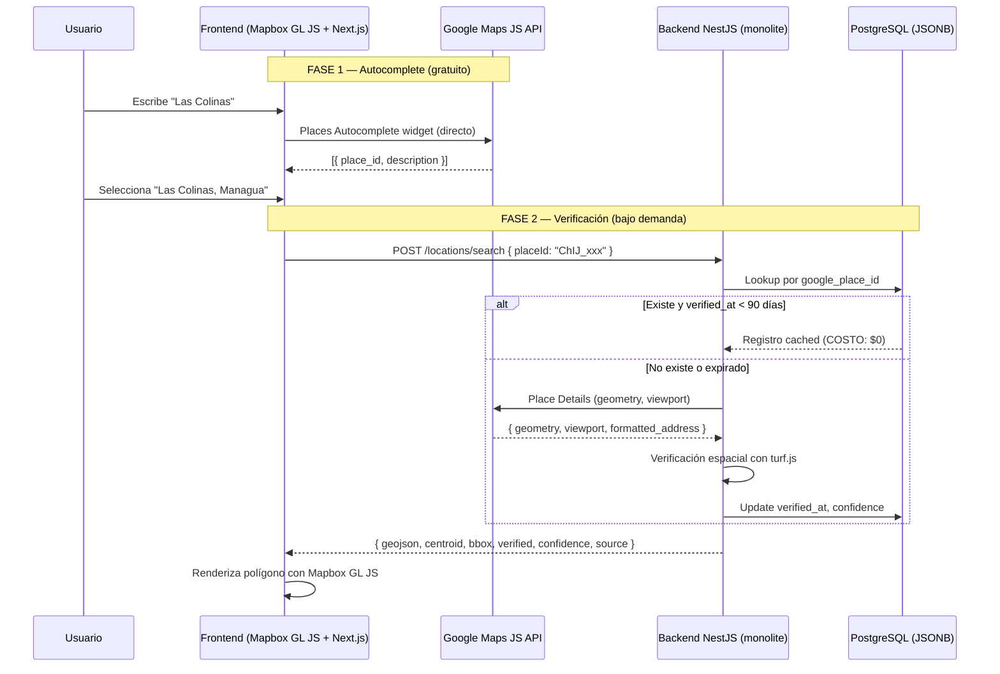

# ADR-011: Arquitectura de Búsqueda y Verificación de Ubicaciones Geográficas

> **Principio de preservación de geometría:** el polígono catastral local (data gubernamental) es **más preciso** que el viewport rectangular de Google. La verificación **nunca reemplaza** el `geojson` local por el viewport de Google. Solo ajusta `verified`, `confidence`, `verifiedAt` y `google_viewport`. El viewport de Google se guarda en `google_viewport` solo como referencia / encuadre, **no** como geometría de pintado.

## Contexto

Patioz necesita un sistema de búsqueda y verificación de ubicaciones geográficas preciso para propiedades inmobiliarias. Los desafíos son:

1. **Precisión geográfica:** los polígonos catastrales locales (data gubernamental) son más precisos que los viewports rectangulares de Google. El sistema debe priorizar los datos locales.
2. **Costos de Google APIs:** Place Details cuesta $17/1K requests. Cada keystroke del usuario no debe generar un costo.
3. **Datos fragmentados:** una misma zona real puede tener múltiples registros locales con nombres distintos o fragmentos espaciales.
4. **Consistencia:** las decisiones de mapas estaban dispersas entre ADR-004 (frontend) y las referencias a módulos `maps` y `locations` en ADR-010, sin una arquitectura unificada.

## Decisión

Se adopta una **arquitectura en dos fases** que separa el autocompletado (frontend, gratuito) de la verificación (backend, bajo demanda), con un **principio rector de preservación de geometría local**.

### Jerarquía de zonas

| Level | Nombre | Ejemplo |
|---|---|---|
| 1 | País | Nicaragua |
| 2 | Departamento | Managua |
| 3 | Municipio | Managua |
| 4 | Distrito | Distrito V |
| 5 | Zona / Barrio | Las Colinas |

### Arquitectura en dos fases



#### Fase 1 — Autocomplete (Frontend → Google Maps JS API)

El frontend usa el widget `Places Autocomplete` de Google Maps JavaScript API **directamente, sin pasar por el backend**.

- **Razones:** latencia optimizada (debounce + caché local de Google), costo $0 (gratis hasta 28K solicitudes/día), UX completa (dropdown, resaltado, teclado).
- **Costo:** $0 para la capa estándar de Autocomplete widget.

#### Fase 2 — Verificación (Frontend → Backend → Google Place Details)

Cuando el usuario selecciona una sugerencia, el frontend envía el `place_id` al backend. El backend ejecuta el flujo de verificación con tres chequeos espaciales encadenados.

> **Requisito de Place Details API:** debe solicitar `fields: ["geometry", "geometry.viewport", "formatted_address", "name"]`. El campo `geometry.viewport` es obligatorio para la verificación de contención de centroid y ratio de áreas.

### Modelo de datos (JSONB en PostgreSQL)

Tabla `locations`:

```typescript
interface Location {
  id: string;                    // UUID
  googlePlaceId: string;         // place_id de Google
  name: LocalizedString;         // { es: "Las Colinas", en: null }
  geojson: GeoJSON.Polygon;      // Polígono catastral local (NO el viewport de Google)
  centroid: { lat: number; lng: number };        // Precomputado con turf.centroid
  bbox: { north: number; south: number; east: number; west: number };  // Precomputado con turf.bbox
  googleViewport?: {             // Solo como referencia, NO para pintado
    north: number;
    south: number;
    east: number;
    west: number;
  };
  googleFormattedAddress?: string;
  level: 1 | 2 | 3 | 4 | 5;     // País, Depto, Municipio, Distrito, Zona/Barrio
  parentId: string | null;       // UUID del padre en la jerarquía
  verified: boolean;             // true si pasó verificación espacial
  verifiedAt: string | null;     // ISO date de última verificación
  verifiedBy: 'google_maps' | 'manual' | null;
  confidence: 'high' | 'medium' | 'low';
  source: 'local' | 'google';
  fusedFrom?: string[];          // IDs de registros fusionados en reconciliación batch
}
```

**Índices:** GIN sobre `geojson` (JSONB) para consultas de contención, índice en `google_place_id` para lookup rápido, índice compuesto en `(parent_id, level)` para búsquedas jerárquicas.

### Algoritmo de verificación espacial

Tres chequeos encadenados ejecutados cuando un location existe pero su `verified_at` está expirado (>90 días) o es nuevo:

```
Chequeo 1 — Contención del centroid
  ¿El centroid del polígono local cae dentro del viewport de Google?
  ├─ No  → confidence = "low",  verified = false
  └─ Sí  → continuar al chequeo 2

Chequeo 2 — Ratio de áreas (localAreaKm2 / viewportAreaKm2)
  ├─ 0.4 – 0.95              → confidence = "high",   verified = true
  ├─ 0.2 – 0.4 | 0.95 – 1.3  → confidence = "medium", verified = true
  └─ fuera de rango          → confidence = "low",    verified = false

Chequeo 3 (opcional) — Solape
  turf.intersect(polygonLocal, viewportBbox) / localArea > 0.7
  → refuerza confidence a "high"
```

**Thresholds configurables vía ConfigService** (no hardcodeados):

```env
GEO_VERIFICATION_AREA_RATIO_MIN=0.4
GEO_VERIFICATION_AREA_RATIO_MAX=0.95
GEO_VERIFICATION_AREA_RATIO_MEDIUM_MIN=0.2
GEO_VERIFICATION_AREA_RATIO_MEDIUM_MAX=1.3
GEO_VERIFICATION_CENTROID_CONTAINMENT=true
GEO_VERIFICATION_OVERLAP_THRESHOLD=0.7
GEO_VERIFICATION_TTL_DAYS=90
```

### Matriz de estados del Location

| `verified` | `source` | `confidence` | Significado | Pintado sugerido en Mapbox GL JS |
|:---:|:---:|:---:|---|---|
| true | local | high | Polígono local validado contra Google | borde sólido, opacidad normal |
| true | local | medium | Validado con dudas de área | borde sólido + ícono "?" |
| false | local | low | Existe local pero no coincide con Google | borde discontinuo, opacidad baja |
| false | google | — | No existe local, solo centro de Google | marcador punto, sin polígono |

El frontend **siempre** debe poder renderizar algo: si `geojson` es null (source=google), pinta un marcador en `centroid`; si existe, pinta el polígono con el estilo correspondiente.

### Endpoints

| Endpoint | Método | Propósito |
|---|---|---|
| `GET /locations?level=1&country=NI` | GET | Listar departamentos (dropdown) |
| `GET /locations?level=2&parentId=<id>` | GET | Listar municipios (dropdown anidado) |
| `GET /locations/:id/geometry` | GET | Obtener GeoJSON de una ubicación (mapa) |
| `POST /locations/search` | POST | Buscar + verificar con Google Place Details |
| `GET /locations/containing?lat=&lng=` | GET | Qué ubicaciones contiene un punto (click mapa) |
| `POST /admin/locations/reconcile` | POST | Reconciliación batch de datos |

**Request `POST /locations/search`:**

```json
{ "placeId": "ChIJ_xxx", "query": "Las Colinas, Managua" }
```

**Response:**

```json
{
  "id": "uuid | null",
  "name": { "es": "Las Colinas", "en": null },
  "geojson": { "type": "Polygon", "coordinates": [[...]] } | null,
  "centroid": { "lat": 12.13, "lng": -86.25 } | null,
  "bbox": { "north": 12.14, "south": 12.12, "east": -86.24, "west": -86.26 } | null,
  "verified": true,
  "source": "local" | "google",
  "confidence": "high" | "medium" | "low"
}
```

### Job de reconciliación batch

Además del flujo de búsqueda en tiempo real, existe un job administrativo que limpia datos locales:

**Tipo A — Duplicado exacto por placeId:** dos locations con el mismo `google_place_id`. Se fusionan con `turf.union(polyA, polyB)`, se reasignan propiedades y se elimina el duplicado.

**Tipo B — Fragmentos de una misma zona real (placeIds distintos):** el escenario "Las Colinas Norte" + "Las Colinas Sur". Dos locations con placeIds distintos que en conjunto conforman una misma zona real. Se indexan candidatos por `(parent_id, level)` y se evalúa `turf.booleanPointInPolygon(centroidDeGoogle, unionDeVecinos)`. Si coinciden, se fusionan con `turf.union`, se asigna el placeId canónico de Google, y se marcan los originales como `fused`.

### Costos de Google Maps API

| API | Costo por 1K requests | Cuándo se usa |
|---|---|---|
| Autocomplete (JS API) | **$0** (gratis hasta 28K/día) | Cada keystroke del usuario |
| Geocoding | $5.00 | Reconciliación batch de datos locales |
| Place Details | $17.00 | Solo cuando no existe en BD o expirado |

**Optimización:**

| Estrategia | Ahorro estimado |
|---|---|
| Autocomplete directo desde frontend | Elimina 100% de llamadas al backend por keystrokes |
| Caché local con `google_place_id` | Elimina ~95% de Place Details después del seed inicial |
| TTL de 90 días en `verified_at` | Reduce Place Details a ~4 veces/año por location |

**Costo mensual estimado para Nicaragua:** ~$85/mes.

### Fallbacks y edge cases

1. **Usuario no selecciona sugerencia de Google** (presiona Enter directamente): frontend envía `{ "query": "Las Colinas" }`, backend usa Google Autocomplete → primera sugerencia, o busca en `locations` por nombre similar (LIKE), o devuelve error.
2. **Google Maps JS API no disponible**: frontend muestra mensaje de error, permite escribir dirección manualmente.
3. **Place Details falla**: backend retorna resultado local (si existe) con `verified: false` y `source: 'local'`.

## Alternativas Consideradas

| Alternativa | Vs decisión | Decisión |
|---|---|---|
| **PostGIS** | Consultas espaciales nativas SQL, índices R-Tree, ST_Within, ST_DWithin | Se elige JSONB + Turf.js — evita extensión de BD, operaciones geo en runtime, mismo stack que el resto del monolite |
| **Google Maps SDK (frontend)** | Mayor calidad visual, autocompletado nativo | Se elige Mapbox GL JS — vector tiles, mejor rendimiento, free hasta 50K map loads/mes (ver maps-001) |
| **Leaflet + OSM** | Gratuito, sin API key, open-source, probado | Se reemplaza por Mapbox GL JS — raster tiles, sin rotación, menor calidad visual LatAm (ver maps-001) |
| **Geocoding 100% backend** | Control total de costos, caché centralizado | Se elige híbrido — autocomplete frontend (latencia, $0) + verificación backend (bajo demanda) |
| **Polígonos en archivos estáticos** | Simplicidad, sin BD | Se elige JSONB en BD — consultables, actualizables vía API, relacionables con otras entidades |
| **Nominatim/OSM como fallback** | Gratuito, datos abiertos | Se elige Google (mismo proveedor) — consistencia de datos entre autocomplete y place details |

## Consecuencias

### Positivas

- **Precisión geográfica mejorada:** el polígono catastral local nunca es reemplazado por el viewport de Google. La verificación solo ajusta metadatos (verified, confidence).
- **Costo controlado:** autocomplete gratuito, Place Details solo bajo demanda con TTL de 90 días y caché local.
- **Estandarización:** una sola estrategia geo en todo el sistema (JSONB + Turf.js), sin PostGIS, sin archivos estáticos.
- **Replace de ADR-004:** resuelve la discrepancia entre decisión frontend (ADR-004) y módulos backend (maps/locations en ADR-010).
- **Frontend siempre renderizable:** matriz de estados garantiza que siempre hay algo que pintar (polígono o marcador).
- **Jerarquía explícita:** 5 niveles bien definidos permiten navegación por dropdowns anidados y breadcrumbs.

### Negativas / Riesgos

- **Turf.js en runtime** agrega complejidad vs consultas PostGIS nativas. Operaciones como punto-en-polígono sobre grandes conjuntos pueden ser lentas sin indexación espacial previa.
- **JSONB sin PostGIS** limita consultas espaciales complejas (ST_DWithin, buffers, rutas). Si el sistema requiere búsquedas de radios en el futuro, se necesitará migrar a PostGIS.
- **Geocoding híbrido** agrega latencia y puntos de falla (Google, backend, BD). El documento define fallbacks para mitigar.
- **Mantenimiento manual de GeoJSON:** los polígonos se crean y mantienen manualmente, lo que requiere un proceso de actualización y verificación periódica.

### Mitigaciones

- La indexación por `(parent_id, level)` en la reconciliación batch evita O(n²) sobre el catálogo completo.
- ConfigService expone thresholds sin redeploy para tunear verificación espacial.
- El TTL de 90 días y la matriz de estados permiten operar con datos no verificados sin bloquear la UX.
- Si se necesita PostGIS en el futuro, JSONB es migrable: se puede agregar una columna `geometry(Geometry, 4326)` y backfill desde `geojson`.

## Estado

- [ ] Propuesto
- [x] Aceptado
- [ ] Rechazado
- [ ] Reemplazado por ADR-XXX

---

> *Este ADR reemplaza a ADR-004 y formaliza la arquitectura completa de búsqueda y verificación de ubicaciones. La decisión se basa en el principio de preservación de geometría: los datos catastrales locales son la fuente de verdad; Google es solo un verificador externo.*

## Referencias

- Reemplaza a ADR-004 (Frontend con Next.js + Leaflet + Búsqueda Híbrida)
- Complementa ADR-010 (documenta formalmente los módulos `maps` y `locations`)
- Depende de [[patioz/adr/maps/001-mapbox-renderer|maps/001]] (Mapbox GL JS como renderer del mapa)
- Depende de [[patioz/adr/maps/002-google-places-provider|maps/002]] (Google Places como provider de datos)
- Ver Apéndice A para el detalle completo del flujo de búsqueda y verificación

---

## Apéndice A: Flujo de Búsqueda y Verificación de Ubicaciones

> Documento original del arquitecto — integrado como apéndice.

### Principio de preservación de geometría

El polígono catastral local (data gubernamental) es **más preciso** que el viewport rectangular de Google. La verificación **nunca reemplaza** el `geojson` local por el viewport de Google. Solo ajusta `verified`, `confidence`, `verifiedAt` y `google_viewport`. El viewport de Google se guarda en `google_viewport` solo como referencia / encuadre, **no** como geometría de pintado.

### Arquitectura General

El buscador de ubicaciones (searchbar) funciona en **dos fases** para optimizar costos, latencia y precisión:

```
Fase 1 (Frontend):  Usuario escribe → Google Maps JS API (Autocomplete) → place_id
Fase 2 (Backend):   place_id → lookup local → verificación → GeoJSON
```

---

### Fase 1: Autocomplete (Frontend → Google Maps JS API)

El frontend usa el widget `Places Autocomplete` de Google Maps JavaScript API directamente. **No pasa por el backend**.

#### Flujo

```
Usuario escribe "Manag" en el searchbar
  ↓
Frontend → Google Maps JS API (Places Autocomplete widget)
  ↓
Google responde con sugerencias: [{ place_id, description, main_text }]
  ↓
Usuario selecciona "Managua, Nicaragua"
  ↓
Frontend obtiene place_id = "ChIJ..."
```

#### ¿Por qué directo a Google y no al backend?

| Razón | Explicación |
|---|---|
| **Latencia** | El widget de Google ya está optimizado con debounce, caching local y respuesta inmediata |
| **Costo** | Google Places JS API no cobra por el Autocomplete widget (solo por Place Details) |
| **UX** | Google maneja el dropdown, resaltado de matches, y teclado |
| **Servidor** | No consumimos recursos del backend para cada keystroke |

#### Costo

El widget Autocomplete de Google Maps JavaScript API es **gratuito** hasta 28,000 solicitudes/día en la capa estándar. No hay costo adicional por las sugerencias de autocompletado.

---

### Fase 2: Verificación (Frontend → Backend → Google Place Details)

Cuando el usuario selecciona una sugerencia, el frontend envía el `place_id` al backend.

> **Requisito de API:** `placeDetails` debe pedir `fields: ["geometry", "geometry.viewport", "formatted_address", "name"]`. El campo `geometry.viewport` es **obligatorio** para la verificación de contención de centroid y ratio de áreas. Sin él, la verificación espacial no es posible.

#### Request

```
POST /api/v1/locations/search
Content-Type: application/json

{
  "placeId": "ChIJxR3gG4FHZIgR6oF5QHxQKXU",
  "query": "Managua, Nicaragua"     // opcional, solo como fallback
}
```

#### Response

```json
{
  "id": "uuid | null",
  "name": { "es": "Las Colinas", "en": null },
  "geojson": { "type": "Polygon", "coordinates": [[...]] } | null,
  "centroid": { "lat": 12.13, "lng": -86.25 } | null,
  "bbox": { "north": 12.14, "south": 12.12, "east": -86.24, "west": -86.26 } | null,
  "verified": true,
  "source": "local" | "google",
  "confidence": "high" | "medium" | "low"
}
```

- `bbox`: bounding box del `geojson` (precomputado con `turf.bbox`) para que el frontend encuadre sin recalcular.
- `confidence`: nivel de confianza de la verificación espacial. El frontend lo usa para decidir estilo de pintado (ver [Estados del Location](#estados-posibles-del-location)).

#### Flujo del Backend

```
1. ¿Se proporcionó place_id?
   ├─ Sí → usarlo directamente
   └─ No → Google Autocomplete(query) → obtener place_id

2. Buscar en locations WHERE google_place_id = ?
   ├─ Encontrado + verified_at < 90 días → devolver GeoJSON local (COSTO: $0)
   ├─ Encontrado + verified_at expirado → Place Details → verificar área → devolver
   └─ No encontrado → Place Details → crear registro nuevo → devolver
```

#### Diagrama Detallado

```
POST /locations/search { placeId: "ChIJ..." }
         │
         ▼
   ┌─────────────┐
   │  Lookup en   │
   │  locations   │
   │  google_     │
   │  place_id    │
   └──────┬──────┘
          │
     ┌────┴────┬────┐
     ▼         ▼    ▼
   Existe    Existe  No
   y         pero    existe
   verificado expirado
     │         │      │
     │         ▼      ▼
     │    ┌──────────────┐
     │    │ Place Details│  ← $0.017/request
     │    │  (Google)    │
     │    └──────┬───────┘
     │           │
     │      ┌────┴─────┐
     │      │ Verificar │
     │      │ área con  │
     │      │ turf.js   │
     │      └────┬──────┘
     │           │
     │      ┌────┴─────┐
     │      │ ratio     │
     │      │ 0.4-0.95?│
     │      └────┬──────┘
     │           │
     │     ┌─────┴──────┐
     │     │             │
     │    Sí             No
     │     │             │
     │  update       update     create
     │  verified_at  verified   registro
     │  = now()      mark      nuevo
     │     │         warning     │
     └─────┴──────────┴──────────┘
               │
               ▼
         Devolver GeoJSON
         + centroid + source
```

#### Verificación de Coherencia Espacial

Cuando un location ya existe pero su `verified_at` está expirado (>90 días), se re-verifica con **tres chequeos** encadenados. Comparar solo áreas no basta: un polígono del tamaño correcto pero en otra ciudad pasaría el filtro. Por eso se valida primero **ubicación** (contención del centroid) y luego **magnitud** (ratio de áreas).

```
Chequeo 1 — Contención del centroid
  ¿El centroid del polígono local cae dentro del viewport de Google?
  ├─ No  → confidence = "low",  verified = false   (no reemplazar geometría)
  └─ Sí  → continuar al chequeo 2

Chequeo 2 — Ratio de áreas  (localAreaKm2 / viewportAreaKm2)
  ├─ 0.4 – 0.95              → confidence = "high",   verified = true
  ├─ 0.2 – 0.4 | 0.95 – 1.3  → confidence = "medium", verified = true  (tolerante)
  └─ fuera de rango          → confidence = "low",    verified = false

Chequeo 3 (opcional) — Solape
  turf.intersect(polygonLocal, viewportBbox) / localArea > 0.7
  → refuerza confidence a "high"
```

```typescript
const ratio = localAreaKm2 / viewportAreaKm2;
const centroidContained = turf.booleanPointInPolygon(
  turf.point([local.centroid.lng, local.centroid.lat]),
  turf.bboxPolygon([viewport.west, viewport.south, viewport.east, viewport.north]),
);

if (!centroidContained) {
  // El polígono local no corresponde a esta zona de Google
  await update(location.id, { verifiedAt: now(), verifiedBy: 'google_maps', confidence: 'low', verified: false });
} else if (ratio >= 0.4 && ratio <= 0.95) {
  await update(location.id, { verifiedAt: now(), verifiedBy: 'google_maps', confidence: 'high', verified: true });
} else if (ratio >= 0.2 && ratio <= 1.3) {
  await update(location.id, { verifiedAt: now(), verifiedBy: 'google_maps', confidence: 'medium', verified: true });
} else {
  await update(location.id, { verifiedAt: now(), verifiedBy: 'google_maps', confidence: 'low', verified: false });
}
```

##### Por qué estos rangos

- Un viewport de Google es un **rectángulo de encuadre de cámara**, no el polígono real del barrio. Suele ser más grande que la zona real.
- El área local (polígono catastral) casi siempre será **menor** que el viewport.
- **0.4** evita falsos negativos para formas irregulares (zonas costeras, montañosas, alargadas).
- **0.95** detecta polígonos que son casi tan grandes como el viewport (probablemente incorrectos: se tragaron zona vecina).
- La banda **medium (0.2–0.4 \| 0.95–1.3)** es tolerante para no invalidar datos válidos pero dudosos.

##### Umbrales como configuración

Los magic numbers **no van hardcoded** en el service. Se exponen vía `ConfigService` para poder tunear sin redeploy:

```env
GEO_VERIFICATION_AREA_RATIO_MIN=0.4
GEO_VERIFICATION_AREA_RATIO_MAX=0.95
GEO_VERIFICATION_AREA_RATIO_MEDIUM_MIN=0.2
GEO_VERIFICATION_AREA_RATIO_MEDIUM_MAX=1.3
GEO_VERIFICATION_CENTROID_CONTAINMENT=true
GEO_VERIFICATION_OVERLAP_THRESHOLD=0.7
GEO_VERIFICATION_TTL_DAYS=90
```

---

### Costos de Google Maps API

| API | Costo por 1K requests | Cuándo se usa |
|---|---|---|
| Autocomplete (JS API) | **$0** (gratis hasta 28K/día) | Cada keystroke del usuario — frontend directo |
| Geocoding | $5.00 | Solo reconciliación batch de datos locales |
| Place Details | $17.00 | Solo cuando el location no existe en BD o está expirado |

#### Optimización de Costos

| Estrategia | Ahorro estimado |
|---|---|
| Autocomplete directo desde frontend | Elimina 100% de llamadas al backend por keystrokes |
| Cache local con `google_place_id` | Elimina ~95% de Place Details después del seed inicial |
| TTL de 90 días en `verified_at` | Reduce Place Details a ~4 veces/año por location |
| Reconciliación batch | Un solo pase de ~200 geocodificaciones = ~$1.00 total |

**Costo mensual estimado para Nicaragua: ~$85/mes** (principalmente Autocomplete JS API, que es gratuito hasta cierto límite).

---

### Fallbacks y Edge Cases

#### Si el usuario no selecciona una sugerencia de Google

Si el usuario escribe "Las Colinas" y presiona Enter sin seleccionar del dropdown de Google, el frontend envía:

```json
{ "query": "Las Colinas" }
```

El backend entonces:
1. Llama a Google Autocomplete con "Las Colinas"
2. Si Google devuelve sugerencias → usa la primera (place_id)
3. Si Google no devuelve nada → busca en `locations` por nombre similar (LIKE %...%)
4. Si encuentra en BD → devuelve ese resultado
5. Si no encuentra nada → devuelve error de "no encontrado"

#### Si Google Maps JS API no está disponible

El frontend muestra un mensaje de error y permite al usuario escribir la dirección manualmente. El backend procesa solo con `query` como fallback.

#### Si Place Details falla

El backend retorna el resultado local (si existe) con `verified: false` y `source: 'local'`. El frontend muestra el polígono igual pero con un indicador visual de "no verificado".

---

### Reconciliación Batch (Limpieza de Datos)

Además del flujo de búsqueda en tiempo real, existe un job administrativo que limpia los datos locales. Hay **dos tipos** de duplicación que el job debe detectar:

#### Tipo A — Duplicado exacto por placeId

Dos (o más) locations resuelven al **mismo** `google_place_id` vía Autocomplete. Caso claro: mismo barrio cargado dos veces con nombres ligeramente distintos.

#### Tipo B — Fragmentos de una misma zona real (placeIds distintos)

El escenario "Las Colinas Norte" + "Las Colinas Sur": Google tiene **un** "Las Colinas" con placeId X, pero el dataset local tiene dos rows con placeIds distintos (o nulos) que **juntas** conforman esa zona. El matching por placeId **no** las agrupa — se necesita matching espacial.

```
POST /admin/locations/reconcile { dryRun: true }

Para cada location SIN google_place_id (indexados por parent_id + level):
  1. Autocomplete(nombre + ", Nicaragua") → placeId + viewport de Google
  2. ¿Ya existe otro location con el MISMO placeId?
     ├─ Sí → DUPLICADO EXACTO (Tipo A)
     │       → turf.union(polyA, polyB) → fusión
     │       → reasignar propiedades → eliminar duplicado
     └─ No → matching espacial (Tipo B):
         ¿El centroid de Google cae dentro de la UNIÓN turf
         de locations vecinas del mismo nivel + parent_id?
         ├─ Sí → son fragmentos de una misma zona real
         │       → turf.union(fragmentos) → fusión
         │       → asignar placeId canónico de Google
         │       → marcar los fragmentos originales como "fused"
         │       → reasignar propiedades → eliminar duplicados
         └─ No → caso simple: asignar placeId, normalizar nombre
```

#### Indexación espacial previa

Para que el matching espacial del Tipo B sea viable, el job **no** compara contra todo el país. Primero indexa candidates por `(parent_id, level)` y solo evalúa `turf.booleanPointInPolygon(centroidDeGoogle, unionDeVecinos)` dentro de cada grupo. Sin este pre-filtro, el costo es O(n²) sobre el catálogo completo.

Esto resuelve el problema de datos fragmentados donde una misma zona real tiene múltiples nombres locales — tanto por placeId idéntico (Tipo A) como por fragmentos contiguos que Google ve como una sola zona (Tipo B).

---

### Resumen de Endpoints

| Endpoint | Método | Propósito |
|---|---|---|
| `GET /locations?level=1&country=NI` | GET | Listar departamentos (dropdown) |
| `GET /locations?level=2&parentId=<id>` | GET | Listar municipios (dropdown anidado) |
| `GET /locations/:id/geometry` | GET | Obtener GeoJSON de una ubicación (mapa) |
| `POST /locations/search` | POST | Buscar + verificar con Google Maps |
| `GET /locations/containing?lat=&lng=` | GET | Qué ubicaciones contiene un punto (click mapa) |
| `POST /admin/locations/reconcile` | POST | Reconciliación batch de datos |

#### Flujo Completo en el Mapa

```
1. Usuario escribe "Las Colinas"
   → Frontend → Google JS API Autocomplete (directo)
   → Dropdown muestra sugerencias

2. Usuario selecciona "Las Colinas, Managua"
   → Frontend tiene: place_id = "ChIJ_xxx", name = "Las Colinas"
   → POST /locations/search { placeId: "ChIJ_xxx" }
   → Backend devuelve: {
       geojson: {Polygon},
       centroid: {lat,lng},
       bbox: {north,south,east,west},
       source: "local",
       verified: true,
       confidence: "high"
     }
   → Frontend renderiza el GeoJSON con Mapbox GL JS (map.addSource geojson + addLayer fill/line) y encuadra con bbox
   → El estilo de pintado (borde/opacidad/ícono) depende de confidence

3. Usuario hace clic en el mapa (lat=12.13, lng=-86.25)
   → GET /locations/containing?lat=12.13&lng=-86.25
   → Backend devuelve: [ {Nicaragua, level1}, {Managua, level2}, {Managua, level3}, {Distrito V, level4}, {Las Colinas, level5} ]
   → Frontend muestra breadcrumb: Nicaragua > Managua > Managua > Distrito V > Las Colinas
```

### Estados Posibles del Location

Vocabulario compartido entre backend y frontend para interpretar el resultado de `/locations/search`:

| `verified` | `source` | `confidence` | Significado | Pintado sugerido en Mapbox GL JS |
|:---:|:---:|:---:|---|---|
| true  | local  | high   | Polígono local validado contra Google | borde sólido, opacidad normal |
| true  | local  | medium | Validado con dudas de área | borde sólido + ícono "?" |
| false | local  | low    | Existe local pero no coincide con Google | borde discontinuo, opacidad baja |
| false | google | —      | No existe local, solo centro de Google | marcador punto, sin polígono |

El frontend **siempre** debe poder renderizar algo: si `geojson` es null (source=google), pinta un marcador en `centroid`; si existe, pinta el polígono con el estilo de la tabla.
