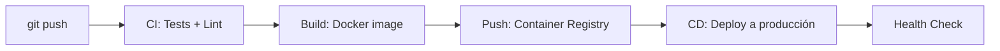

# Runbook: Deploy

## Pipeline General

Cada microservicio sigue el mismo pipeline CI/CD:



## Paso a paso

### 1. Build

```bash
docker build -t patioz/<servicio>:<tag> .
```

### 2. Push a registry

```bash
docker tag patioz/<servicio>:<tag> <registry>/patioz/<servicio>:<tag>
docker push <registry>/patioz/<servicio>:<tag>
```

### 3. Deploy

El deploy se maneja según el entorno:

| Entorno | Método | Notas |
|---|---|---|
| **Desarrollo** | Docker Compose local | `docker compose up -d` |
| **Staging** | Kubernetes (namespace staging) | `kubectl apply -f k8s/staging/` |
| **Producción** | Kubernetes (namespace prod) | Rolling update automático vía CI/CD |

### 4. Health Check

Verificar que el servicio responde:

```bash
curl https://api.patioz.com/<servicio>/health
```

## Rollback

Si el deploy falla:

```bash
kubectl rollout undo deployment/<servicio> -n production
```

## Notas

- Los secretos (API keys, DB passwords) se inyectan vía Kubernetes Secrets o variables de entorno del entorno.
- Cada servicio debe tener liveness/readiness probes configuradas.
