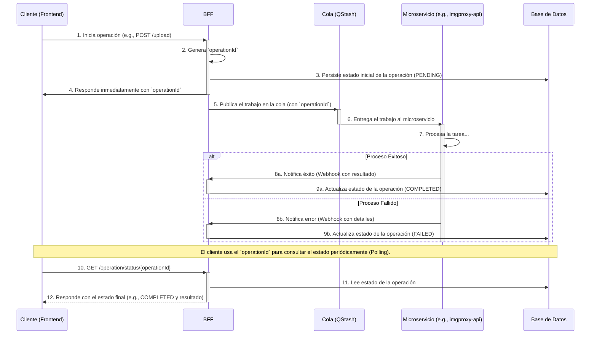

# BFF (Backend for Frontend)

Este servicio actúa como el **Backend for Frontend** o Gateway para toda la plataforma Patioz. Está construido sobre Node.js utilizando TypeScript y el framework Fastify.

## Stack Tecnológico y Justificación

La elección del stack tecnológico se basa en los siguientes principios: rendimiento, robustez y una excelente experiencia de desarrollo.

- **Node.js y Fastify:** Se eligió Fastify por ser un framework web de alto rendimiento y bajo overhead para Node.js. Su arquitectura basada en plugins y su enfoque en la velocidad lo hacen ideal para un BFF, que debe procesar y enrutar un gran volumen de peticiones de manera eficiente, actuando como una capa delgada y rápida frente a los microservicios.

- **TypeScript:** El uso de TypeScript es fundamental para construir un sistema robusto y mantenible. El tipado estático nos permite detectar errores en tiempo de compilación, mejora la legibilidad del código y facilita la colaboración en el equipo.

## Validación de Schemas y DTOs con Zod

La validación de todos los datos de entrada (payloads, query params, etc.) se gestiona exclusivamente con **Zod**. Esta librería juega un doble papel crucial:

1.  **Validación en Tiempo de Ejecución:** Define schemas que validan la estructura y los tipos de los datos de las peticiones HTTP en el borde del sistema (la capa de rutas).
2.  **Inferencia de Tipos Estáticos:** A partir de un único schema de Zod, se infieren automáticamente los tipos de TypeScript para los DTOs (Data Transfer Objects). Esto elimina la duplicación de código y garantiza que los tipos estáticos y las validaciones de runtime estén siempre sincronizados.

## Orquestación Asíncrona con QStash

Para la orquestación de flujos que involucran a múltiples microservicios o para tareas de larga duración (como el procesamiento de subidas de archivos), el BFF utiliza **QStash (de Upstash)**.

Cuando el BFF necesita invocar un proceso en otro microservicio de forma asíncrona, publica un mensaje en una cola de QStash. Esto desacopla los servicios, mejorando la resiliencia y escalabilidad del sistema. Si un microservicio está temporalmente caído, QStash puede reintentar la entrega del mensaje.

### Simulador Local: `localStash`

Para facilitar el desarrollo local, el proyecto incluye un simulador en memoria de QStash (referido como `localStash` o `LocalQueuePublisher`). Esto permite a los desarrolladores probar los flujos de trabajo asíncronos completos en su máquina sin necesidad de una conexión a internet o una cuenta real de QStash, agilizando significativamente los ciclos de prueba y desarrollo. Se activa mediante la variable de entorno `QUEUE_PROVIDER=local`.

## Arquitectura

El proyecto sigue estrictamente los principios de **Arquitectura Limpia (Clean Architecture)** y **Domain-Driven Design (DDD)**. Esto asegura una separación clara de responsabilidades, donde la lógica de negocio del dominio permanece completamente agnóstica a los detalles de la infraestructura (frameworks, bases de datos, colas, etc.). Esta separación facilita las pruebas, el mantenimiento y la evolución del sistema.

## Flujo de Comunicación Asíncrona

El siguiente diagrama ilustra el flujo de una operación asíncrona orquestada por el BFF, como por ejemplo, el procesamiento de una imagen.

